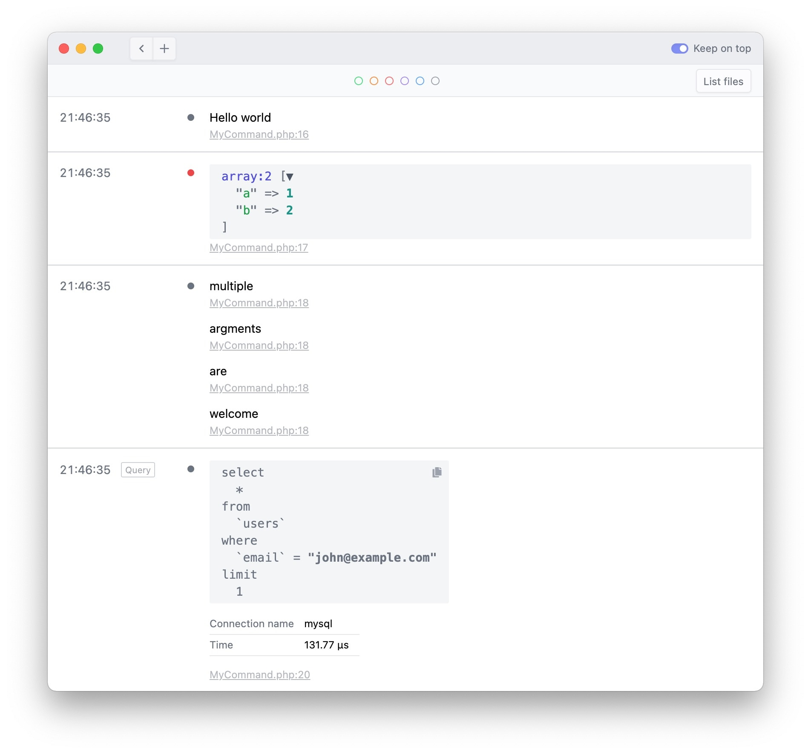
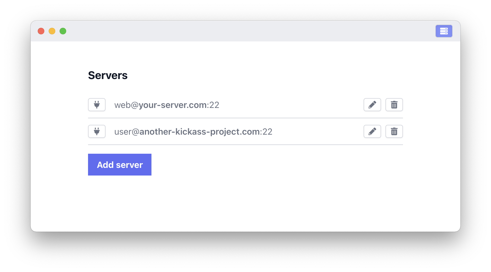

[Ray](https://myray.app) is a beautiful, lightweight desktop app that helps you debug your app. There's a [free demo](https://myray.app) available that can be unlocked with a [license](https://spatie.be/products/ray).

Ray supports PHP, Ruby, JavaScript, TypeScript, NodeJS and Bash applications. After installing [one of the libraries to send information to Ray](/docs/ray/v1/installation-in-your-project/introduction), you can use the `ray` function to quickly dump stuff. Any variable(s) that you pass to `ray` will be displayed.

Here's an example for a Laravel app (for other languages the syntax is similar):
```
ray('Hello world');

ray(['a' => 1, 'b' => 2])->color('red');

ray('multiple', 'arguments', 'are', 'welcome');

ray()->showQueries();

User::firstWhere('email', 'john@example.com');
```

Here's how that looks like in Ray.



There are many other helper functions available on Ray that allow you to display things that can help you debug such as [runtime and memory usage](/docs/ray/v1/usage/framework-agnostic-php-project#measuring-performance-and-memory-usage), [queries that were executed](/docs/ray/v1/usage/laravel#showing-queries), and much more.

In addition to debugging locally, you can also connect to a server. All `ray` calls performed on that server will be securely be forwarded via SSH to your local machine.



